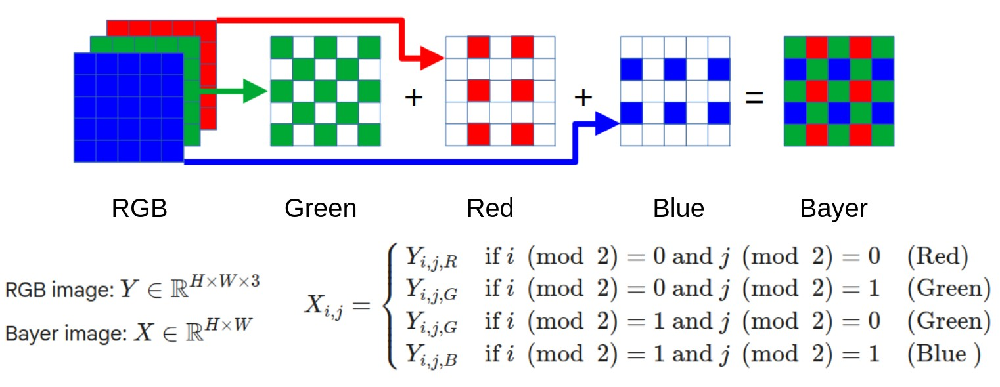

# ***Re-bayer*** project
Utilities for converting RGB images into RAW Bayer files using simple sub-sampling algorithm. 



Tested on Linux only. It *may* work on Windows, but never tested.
# Prerequisites

This project uses **uv** to manage the Python environment and project dependencies. Please install **uv** before proceeding.

## Install uv

### Linux / macOS

```bash
curl -LsSf https://astral.sh/uv/install.sh | sh
```

### Windows (PowerShell)

```powershell
powershell -ExecutionPolicy ByPass -c "irm https://astral.sh/uv/install.ps1 | iex"
```

Alternatively, install using `pip`:

```bash
pip install uv
```

Verify the installation:

```bash
uv --version
```

### Install Project Dependencies

From the project root directory, run:

```bash
uv sync
```

This command creates a virtual environment (if necessary) and installs all required project dependencies.

# Test 
Run test with images of five classes of validation set of ImageNet-1k dataset
```bash
source ./.venv/bin/activate
./run_test.sh
```
Make sure *view-errors.sh* script created with *echo 'No errors found'* output inside

# Utilities included
## Image converter: _re-bayer.py_
Main conversion utility. Utility to convert RGB images into RAW Bayer

### Usage
```bash
source ./.venv/bin/activate
python re-bayer.py -i ./test_data/imagenet_val_5  -o ./test_data/imagenet_val_5_bayer_rggb -p RGGB
```

### Arguments
- `--input-folder`, `-i`
  Input folder with source image files, scanned recursively. Default: `./`
- `--output-folder`, `-o`
  Output folder for `.RAW` files. Relative input sub-folders are preserved. Default: `./out`
- `--pattern`, `-p`
  Bayer pattern: `RGGB`, `GRBG`, `GBRG`, `BGGR`. Default: `RGGB`
  
## Image validator: _validate.py_
Utility to validate converted RAW Bayer. Conversion is performed by checking image Color pixel signal to noise ratio (CPSNR).
Value of 15dB and higher usually means conversion was OK.


### Usage
```bash
source ./.venv/bin/activate
python validate.py -i ./test_data/imagenet_val_5  -o ./test_data/imagenet_val_5_bayer_rggb -p RGGB -m 15 -r validation_results.csv -e ./view-errors.sh
```
### Arguments
- `--input-folder`, `-i`
  Input folder with source image files, scanned recursively. Default: `./`
- `--output-folder`, `-o`
  Output folder for `.RAW` files. Relative input subfolders are preserved. Default: `./out`
- `--pattern`, `-p`
  Bayer pattern: `RGGB`, `GRBG`, `GBRG`, `BGGR`. Default: `RGGB`
- `--min-psnr`, `-m`
  Minimum acceptable PSNR in dB. Default: `15.0`
- `--report-csv, `-r`
  CSV report path. Default: `./validation_report.csv`
- `--psnr-error-view-script, `-e`
  Optional shell script output path. When set, writes commands that run view_raw.py for each RAW file that fails the PSNR threshold.
  Default: `./check_err_images.sh`

Run `./check_err_images.sh` script to view images with CPSNR lower than defined (15dB by default)

### Error codes:

- `0`: validation passed
- `10`: RAW output file missing
- `11`: RAW size does not match source image dimensions
- `12`: de-Bayered image size does not match source image size
- `13`: PSNR below threshold
- `14`: other processing failure

## RAW image viewer: _view_raw.py_

Use `view_raw.py` to open a de-Bayered preview of an 8-bit `.RAW` file.

By default, metadata is parsed from filenames that end with `WIDTHxHEIGHT@PATTERN`,
for example `img0_500x375@RGGB.RAW`.

```bash
source ./.venv/bin/activate
python view_raw.py img0_500x375@RGGB.RAW
```
### Arguments
- `raw_file`
  Path to the `.RAW` file to view. 
- `--width`
  Override image width
- `--height`
  Override image height
- `--bayer-start`
  Override Bayer start/pattern: `RGGB`, `GRBG`, `GBRG`, `BGGR`
- `--wait-ms`
  Milliseconds to keep the OpenCV window open. Default: `0`, wait for a key press
